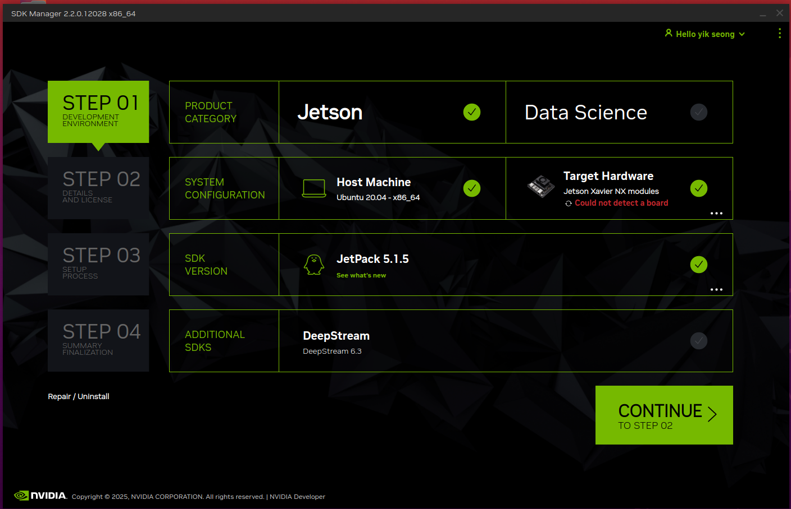
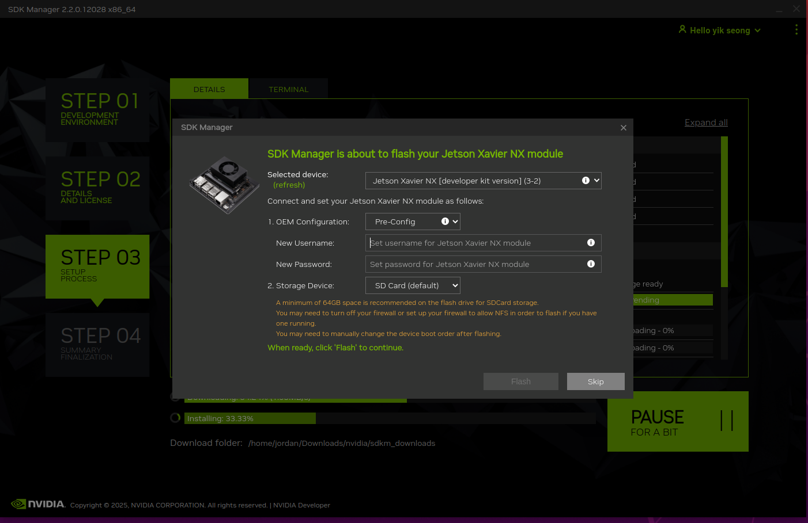

# Jetson_Xavier_flash 
flash jetson xavier with SDK manager and manual command
## Introduction
This documentation is for flash Jetson xavier with SDK manager or manual flash. Information is everywhere but does not have concrete tutorial due to involve at faster rate and poor documentation. This documentation is to provide a proper tutorial/documentation for myself on why and how. 

## SDK manager
### prerequisites
- Ubuntu 20.04 with SDK manager installed
- https://developer.download.nvidia.com/sdkmanager/redirects/sdkmanager-docker-image-ubuntu2004.html
- Note, cannot use latest ubuntu build and older ubuntu build for SDK manager as it will fail to start

### Process
- 
- can additional click extra SDK or setup. 
- proceed to step2, click additional component that required 
- can proceed with download first, install later, after download only proceed to installation
- power off the jetson xavier first, connect a short dupont cable between GND and force recovery pin
- power on the Jetson xavier, the USB connection will appear which requires select jetson model
- if is SD card, default will be developer kit version
- 
- once confirm press flash and observe the progress.
- This only works with carrier board recognized by SDK manager, custom carrier board will have trouble connect to it. (such as from SeedStudio and waveshare)

## For manual Setup

1. get the following packages from jetson archives. https://developer.nvidia.com/embedded/jetson-linux-archive Have to check whether the package supports the jetson model. (Jetson xaviers ends at 35.6.1)
2. 