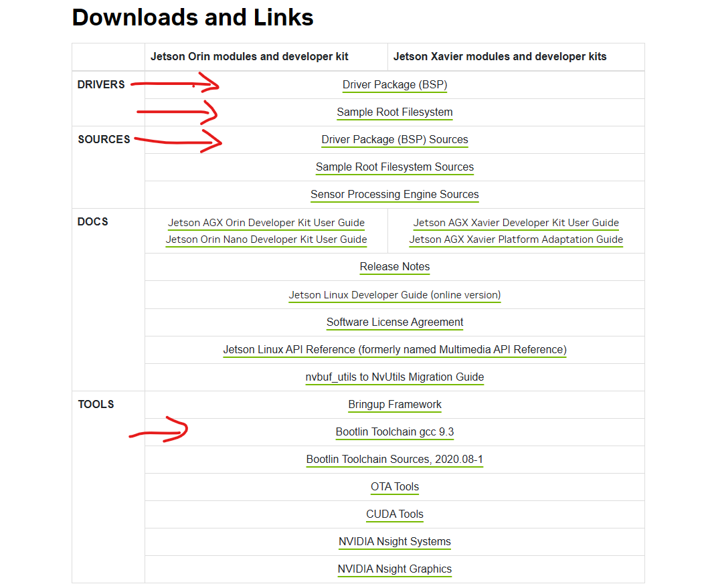

# Jetson_Xavier_flash 
flash jetson xavier with SDK manager and manual command
## Introduction
This documentation is for flash Jetson xavier with SDK manager or manual flash. Information is everywhere but does not have concrete tutorial due to involve at faster rate and poor documentation. This documentation is to provide a proper tutorial/documentation for myself on why and how. 

## SDK manager
### prerequisites
- Ubuntu 20.04 with SDK manager installed
- https://developer.download.nvidia.com/sdkmanager/redirects/sdkmanager-docker-image-ubuntu2004.html
- Note, cannot use latest ubuntu build and older ubuntu build for SDK manager as it will fail to start

### Process
- 
- can additional click extra SDK or setup. 
- proceed to step2, click additional component that required 
- can proceed with download first, install later, after download only proceed to installation
- power off the jetson xavier first, connect a short dupont cable between GND and force recovery pin
- power on the Jetson xavier, the USB connection will appear which requires select jetson model
- if is SD card, default will be developer kit version
- 
- once confirm press flash and observe the progress.
- This only works with carrier board recognized by SDK manager, custom carrier board will have trouble connect to it. (such as from SeedStudio and waveshare)

## For manual Setup

1. get the following packages from jetson archives. https://developer.nvidia.com/embedded/jetson-linux-archive Have to check whether the package supports the jetson model. (Jetson xaviers ends at 35.6.1)
2. 
3. unzip Jetson_Linux_R35.6.1_aarch64 by command ```tar -xjvf Jetson_Linux_R35.6.1_aarch64.tbz2```
4. (Kernel) unzip the public sources and extract the kernel into Jetson_Linux public source folder. ```tar -xvjf kernel_src.tbz2 -C ~/Downloads/Linux_for_Tegra/source/public/```
5. (RFS) unzip the root file system into Linux_for_Tegra/rootfs ```sudo tar -xvjf Tegra_Linux_Sample-Root-Filesystem_R35.6.1_aarch64.tbz2 -C ~/Downloads/Linux_for_Tegra/rootfs/```
6. use ```sudo chroot /rootfs/ ``` for advance root file system config or build in advance
7. run the command ```sudo ./apply_binaries.sh```
8. make sure linux desktop have this installed. run command ``` sudo apt install build-essential bc git wget cpio python3-pip libncurses5-dev libssl-dev flex bison ```
9. export cross_compile_aarch64_path by ```export CROSS_COMPILE_AARCH64_PATH=[path] ``` path is where the location of extraction build compiler
10. export cross_compile ``` export CROSS_COMPILE_AARCH64=[path]/bin/aarch64-buildroot-linux-gnu-```
11. generate the kernel by navigate to source/public where kernel is extracted. run ```./nvbuild.sh -o [file directory]```
12. reference for kernel and root file system https://docs.nvidia.com/jetson/archives/r35.6.1/DeveloperGuide/SD/Kernel/KernelCustomization.html
### This is for pinmux change

13. navigate to kernel/pinmux/t19x and place generated dtsi file from excel inside.
14. pinmux generate config file ```python pinmux-dts2cfg.py --pinmux addr_info.txt gpio_addr_info.txt por_val.txt --mandatory_pinmux_file mandatory_pinmux.txt tegra19x-jetson_xavier_nx_module-pinmux.dtsi tegra19x-jetson_xavier_nx_module-gpio-default.dtsi 1.0 > tegra19x-mb1-pinmux-p3668-0001-a01-p3509-0000-a01.cfg```
15. pinmux padvoltage config file generate ```python pinmux-dts2cfg.py --pad pad_info.txt tegra19x-jetson_xavier_nx_module-padvoltage-default.dtsi  1.0 > tegra19x-mb1-padvoltage-p3668-0001-a01-p3509-0000-a01.cfg ```
16. place the generated cfg file into Linux_for_Tegra/bootloader/t186ref/BCT/
17. Copy generated kernel dtb ```tegra194-p3668-all-p3509-0000.dtb``` from arch/arm64/boot/dts/nvidia and place into Linux_for_Tegra/kernel/dtb
### To prepare for flash
18. create default username and password ```sudo ./l4t_create_default_user.sh -u pi -p raspberry --accept-license```
19. run ./l45_flash_prerequisites.sh
20. To flash the build into jetson, first reboot with force recovery mode
21. Next run command sudo ```./flash.sh jetson-xavier-nx-devkit mmcblk0p1```
22. To flash only dedicated changes such as kernel only. use this command ```sudo ./flash.sh -r -k kernel-dtb jetson-xavier-nx-devkit mmcblk0p1```

For original version R32. please refer to https://medium.com/@haoye94/editing-device-tree-and-compiling-kernel-for-nvidia-jetson-xavier-nx-11a1df20939c
